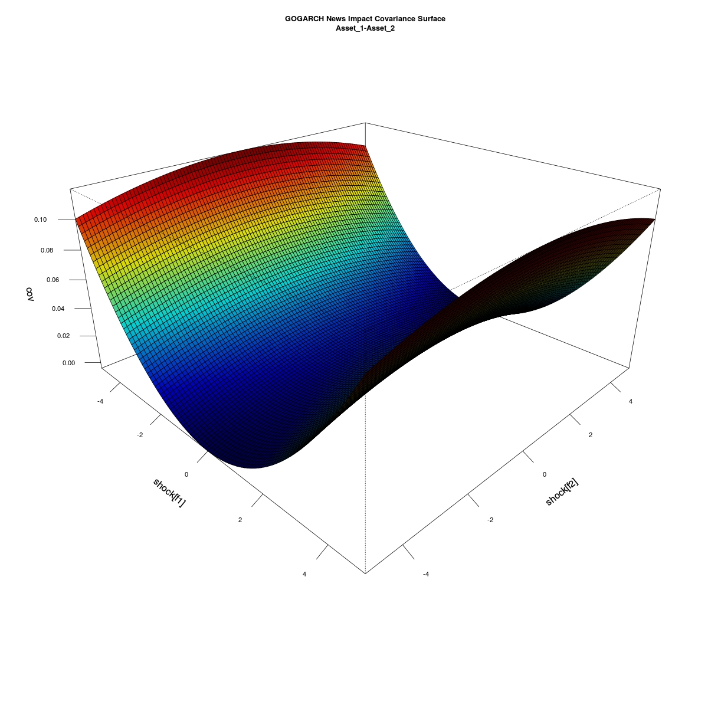
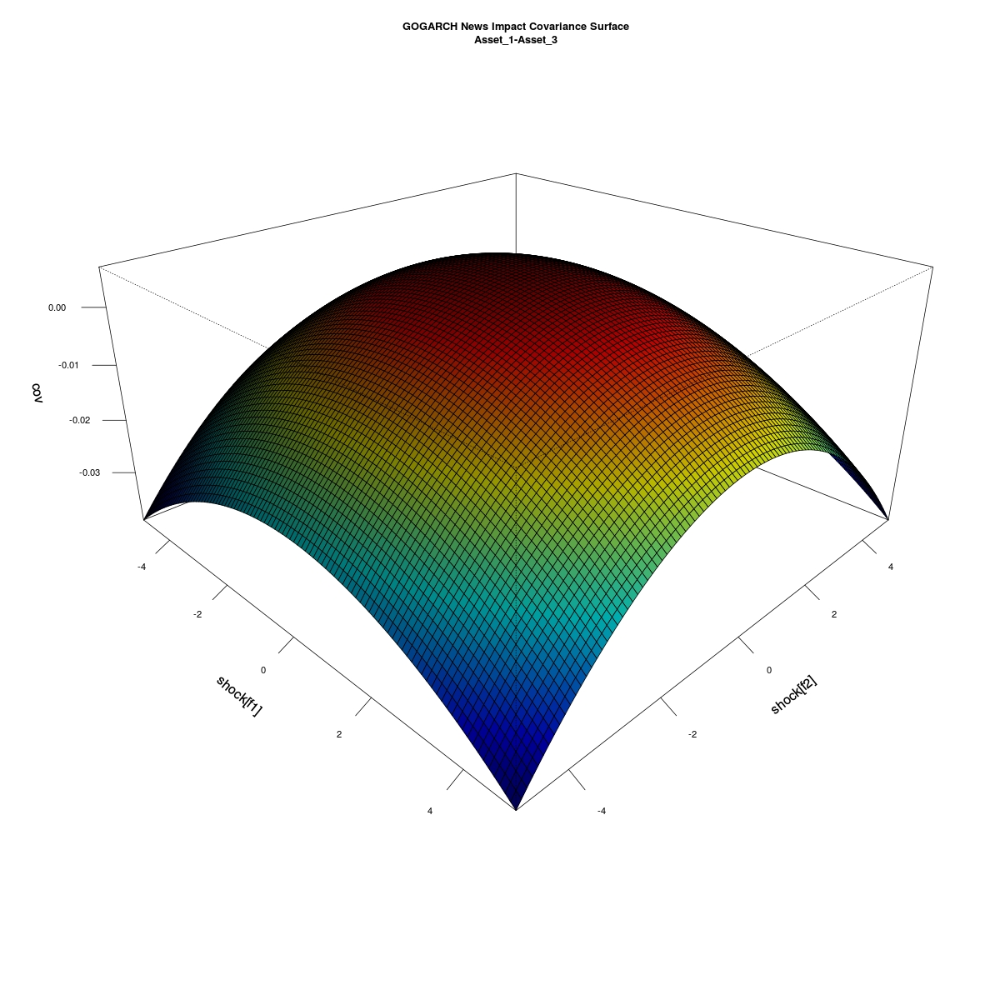
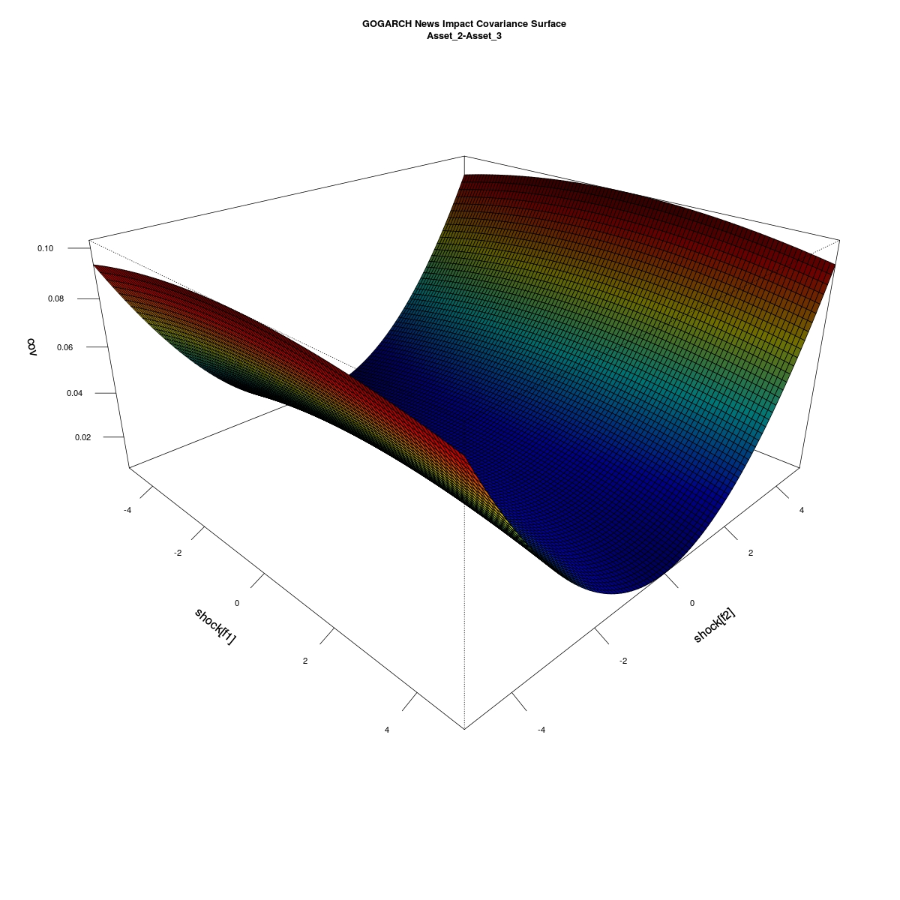

---
output:
    html_document:
        fig_caption: true
        highlight: tango
        number_sections: true
        theme: readable
        self_contained: yes   
    pdf_document: default
--- 
---
title: "Exemplos para processos GARCH multivariados "
author: "Kim Samejima Lopes"  
date: '`r format(Sys.time(), "%d %b, %Y")`'
  
---
   
   <style>
pre code.bash {
  background: lightyellow;
}
</style> 
  
[//]: #         includes:
[//]: #             in_header: mystyles.sty  
[//]: #  theme ("default", "cerulean", "journal", "flatly", "readable", "spacelab", "united", or "cosmo")   
[//]: #  unset SSH_ASKPASS
[//]: #  git config --global credential.helper 'cache --timeout=3600'
[//]: #  git push -u origin master


```{r,echo=F,warning=FALSE,message=FALSE,include=FALSE}
library(rugarch)
library(ccgarch)
library(rmgarch)
library(fGarch)
library(gogarch)
library(MTS)
library(knitcitations)
library(knitr)
library(xtable)
options(xtable.comment = FALSE)
cite_options(cite.style = "numeric")
options(xtable.comment = FALSE)

load("~/Documents/sheetR/MGARCH-Examples/Simulations.Rdata.RData")
```


Este texto trata da construção de exemplos de modelos GARCH multivariados. Para tanto, considere os modelos a seguir:  

* BEKK  (Pacote `MTS`)
* CCC-GARCH e DCC-GARCH  
* GO-GARCH (F-GARCH, O-GARCH)  
* ICA-GARCH e GICA-GARCH   


As próximas sessões apresentarão exemplos de tais modelos utilizando as bibliotecas `ccgarch,rmgarch e gogarch` do **R**.    

<font color="red">  

# BEKK  

</font>  

# CCC-GARCH e DCC-GARCH    
## CCC-GARCH    

Modelos CCC-GARCH são da forma:  

(@eqcccgarch) $$
\label{eq:cccgarch}
\textbf{H}_t = \textbf{D}_t \times \textbf{R}  \times \textbf{D}_t \\
\textbf{D}_t= \left[diag\{h_{ii,t}^{1/2}\}\right],i=1,\dots,n  
$$

$h_{ii,t}$ é um modelo GARCH univariado qualquer e $\textbf{R}= \left[\rho_{i,j}\right],i,j=1,\dots,n$ e $\rho_{i,i}=1,i=1,\dots,n$ é uma matriz simétrica, positiva definida.   
Teremos que $\textbf{H}_t$ será positiva definida se e só se todas as n variâncias condicionais forem positivas e $\textbf{H}_t\ge 0$.
Em particular um CCC-GARCH(1,1) seria da forma dada em  (@eqcccgarch), com $h_{ii,t},i=1,\dots,n$ definidos por   
$$
h_{ii,t}=w_i+a_i\epsilon^2_{i,t-1}+b_i h_{ii,t-1},i=1\dots,n
$$  
Ou seja, cada $h_{ii,t}$ é dado por um GARCH(1,1).

### Exemplo Simulado   
Utilizando o pacote `ccgarch`, simularemos um modelo CCC-GARCH(1,1) bivariado definido por:
$$
\textbf{R}=\left(\begin{array}{cc} 1 & 0.3 \\ 0.3 & 1\end{array}\right) \\
h_{11,t}= 0.05 + 0.1 \epsilon^2_{1,t-1}+ 0.6 h_{11,t-1} \\
h_{22,t}= 0.02 + 0.05 \epsilon^2_{2,t-1}+ 0.75 h_{22,t-1} 
$$  

```
### EXEMPLOS USANDO O PACOTE 'ccgarch'
# eccc.sim Arguments:

# 'nobs'  a number of observations to be simulated (T)
# 'a'     a vector of constants in the GARCH equation (N×1)
# 'A'     an ARCH parameter matrix in the GARCH equation. 
#         Can be a diagonal matrix for the original CCC-GARCH model or a full
#         matrix for the extended model (N×N)
# 'B'     a GARCH parameter matrix in the GARCH equation. 
#         Can be a diagonal matrix for the original CCC-GARCH model or a full
#         matrix for the extended model (N×N)
# 'R'     a constant conditional correlation matrix (N×N)
# 'd.f'   the degrees of freedom parameter for the t-distribution
# 'model' "diagonal" for the diagonal model and "extended" for the extended model

c.a1=c(0.05,0.02)
c.A1=matrix(c(0.1,0,0,0.05),ncol=2)
c.B1=matrix(c(0.6,0,0,0.75),ncol=2)
c.R1=matrix(c(1,0.3,0.3,1),ncol=2)
c.H1<-eccc.sim(nobs=1000, c.a1, c.A1, c.B1, c.R1, d.f=5, model="diagonal")

#'h'      a matrix of the simulated conditional variances (T × N )
#'eps'    a matrix of the simulated time series with (E)CCC-GARCH process (T × N )
```

```{r fig1_sim1}
plot.ts(c.H1$eps, main = "Processos simulados")
```

```{r fig2_sim1}
plot.ts(c.H1$h, main="Volatilidade observada nos processos simulados")
```

Para o processo simulado, vamos estimar os parâmetros utilizando o mesmo pacote, com a função `eccc.estimation`.
Temos duas séries simuladas, e suporemos então que elas seguem um CCC-GARCH(1,1) e são regidas pelo processo:  

(@eqccc_h) $$
\textbf{h}_t=\left(
\begin{array}{c}
 h_{11,t} \\ h_{22,t}
\end{array}
\right)=\textbf{w}+\textbf{A}\textbf{$\epsilon$}_{t-1}\textbf{$\epsilon$}_{t-1}^T+\textbf{B}\textbf{h}_{t-1}=\\
=
\left(\begin{array}{c} a_{1} \\ a_{2} \end{array} \right) + 
\left(\begin{array}{cc} A_{11} & 0 \\ 0 & A_{22} \end{array} \right) 
\left(\begin{array}{c} \epsilon^2_{1,t-1} \\ \epsilon^2_{2,t-1} \end{array} \right) + 
\left(\begin{array}{cc} B_{11}  & 0 \\ 0 & B_{22} \end{array} \right) 
\left(\begin{array}{c} h_{11,t-1} \\ h_{22,t-1} \end{array} \right)
$$

Para estimar o processo, é necessário sugerir os 'chutes' iniciais para o algoritmo de otimização. Façamos então:  

$$
\textbf{w}_0=\textbf{1}_2 \\
\textbf{A}_0=\textbf{I}_2 \\
\textbf{B}_0=\textbf{I}_2 \\
\textbf{R}_0=\textbf{I}_2 \\
$$

```{r est1_code}
c.w0=c(1,1)
c.A0=diag(2)
c.B0=diag(2)
c.R0=diag(2)
c.fit1<-eccc.estimation(a=c.w0,A=c.A0,B=c.B0,R=c.R0,model="diagonal",dvar=c.H1$eps)
c.fit1$opt$convergence
# $convergence == 0 ## Means convergence criteria has reached
```

Os resultados da estimação foram:  

```{r est1_results}
c.fit1$para.mat
c.fit1$out
```
   
[//]: #   OBS: Se Considerarmos o chute inicial para w0=02 ou w0=\mu o processo nao converge para um valor próximo ao valor correto dos parâmetros.

[//]: #   É possivel ainda estimar os resultados do processo CCC-GARCH simulado na seção anterior utilizando o pacote `rmgarch`, considerando que o modelo CCC-GARCH é um caso especial do DCC-GARCH, quando a matriz $R$ é fixa para todo *t*.

```{r, include=FALSE}
#NOT TO RUN#
spec1 = ugarchspec(distribution = "norm")
mspec = multispec(c(spec1,spec1))
fitspec=dccspec(mspec,VAR=TRUE,lag=1,dccOrder=c(1,1),model="DCC",distribution="mvnorm")
fit2=dccfit(fitspec,H1$eps)
```

## DCC-GARCH   

Modelos DCC-GARCH são uma generalização do caso CCC-GARCH, isto é, temos a matris **R** não necessariamente fixa, ou seja, ela varia no tempo:  

(@eqdccgarch) $$
\label{eq:dccgarch}
\textbf{H}_t = \textbf{D}_t \times \textbf{R}_t  \times \textbf{D}_t \\
$$

$\textbf{D}_t$ é definida como em (@eqcccgarch) e $\textbf{R}_t$ tem expressão específica. Tse e Tsui(2002) sugerem $\textbf{R}_t$ definida por (DCCt-GARCH)   

(@eqtse) $$\textbf{R}_t=(1-\theta_1-\theta_2)\textbf{R}+\theta_1\Psi_{t-1}+\theta_2\textbf{R}_{t-1}$$  

Em que $\textbf{R}= \left[\rho_{i,j}\right], i,j = 1,\dots,n$ e $\rho_{i,i}=1,i=1,\dots,n$ é uma matriz simétrica, positiva definida e $\Psi_{t-1}$ uma matriz de correlações de $\epsilon_\tau$ definida convenientemente.   
Já Engle(2002) propõe $\textbf{R}_t$ como (DCCe-GARCH):     

(@eqengle) $$\textbf{R}_t=\left[diag\{\textbf{Q}_t\}\right]^{1/2}\times \textbf{Q}_t \times \left[diag\{\textbf{Q}_t\}\right]^{1/2}$$  

Com $\textbf{Q}_t$ não negativa definida, de ordem $n\times n$ definida de forma semelhante a $\textbf{R}_t$ em (@eqtse), isto é:   

$$\textbf{Q}_t=(1-\alpha-\beta)\textbf{Q}+\alpha \textbf{u}_{t-1}\textbf{u}^T_{t-1}+\beta\textbf{Q}_{t-1}$$  
  
### Exemplo Simulado (DCCe-GARCH)   
Para simular o processo DCC-GARCH, consideraremos os pacotes `ccgarch`. Compararemos o resultado da estimação através dos pacotes `ccgarch`, `rmgarch` e `MTS`, para que possamos comparar suas performances. A parametrização utilizada será aquela proposta por Engle ( veja equação @eqengle).

```
### EXEMPLOS USANDO O PACOTE 'ccgarch'
# dcc.sim Arguments:

# 'nobs'     a number of observations to be simulated (T )
# 'a'        a vector of constants in the vector GARCH equation (N × 1)
# 'A'        an ARCH parameter matrix in the vector GARCH equation (N × N )
# 'B'        a GARCH parameter matrix in the vector GARCH equation (N × N )
# 'R'        an unconditional correlation matrix (N × N )
# 'dcc.para' a vector of the DCC parameters (2 × 1)
# 'd.f'      the degrees of freedom parameter for the t-distribution
# 'model'    a character string describing the model. 
#            "diagonal" for the diagonal model  and "extended" for the extended 
#            (full ARCH and GARCH parameter matrices) model

d.a1=c(0.05,0.02)
d.A1=matrix(c(0.1,0,0,0.05),ncol=2)
d.B1=matrix(c(0.6,0,0,0.75),ncol=2)
d.R1=matrix(c(1,0.3,0.3,1),ncol=2)
d.alpha1 = 0.1
d.beta1  = 0.2
d.H1<-dcc.sim(nobs=1000, d.a1, d.A1, d.B1, d.R1, dcc.para=c(d.alpha1,d.beta1), d.f=5, model="diagonal")

# 'dcc'      a matrix of the simulated dynamic conditional correlations (T × N 2 )
# 'h'        a matrix of the simulated conditional variances (T × N )
# 'eps'      a matrix of the simulated time series with DCC-GARCH process (T × N )

```

```{r fig1_sim2}
plot.ts(d.H1$eps, main = "Processos simulados")
```

```{r fig2_sim2}
plot.ts(d.H1$h, main="Volatilidade observada nos processos simulados")
```

```{r fig3_sim2}
plot.ts(d.H1$dcc, main="Dt")
```

### Estimação via `ccgarch`  

Para estimar os parâmetros do processo simulado acima, considere a função `dcc.est` do `ccgarch`, que estima os parâmetros via máxima verossimilhança em dois estágios.
Assim como no caso do CCC-GARCH, utilizaremos as seguintes quantidades iniciais para o processo iterativo:

$$
\textbf{A}_0=\textbf{I}_2 \\
\textbf{B}_0=\textbf{I}_2 \\
\textbf{R}_0=\textbf{I}_2 \\
\alpha=0.5\\
\beta=0.5
$$

```{r est2_code}
d.w0=c(0.2,0.2)
d.A0=diag(2)
d.B0=diag(2)
d.alpha0 = 0.5
d.beta0  = 0.5
d.fit1<-dcc.estimation(inia=d.w0,iniA=d.A0,iniB=d.B0,ini.dcc=d.w0,model="diagonal",dvar=d.H1$eps)
```

Os resultados da estimação seguem abaixo:

```{r}
d.fit1$out
```

### Estimação via `rmgarch`

Novamente, utilizaremos a parametrização para $\textbf{R}_t$ proposta por Engle (2002) (equação @eqengle). Para estimar o processo `rmgarch` é necessário inicialmente declarar as especificações do modelo. Para tanto, considerando normalidade   


```{r}
spec1 = ugarchspec(distribution = "std")
mspec = multispec(c(spec1,spec1))
fitspec=dccspec(mspec,VAR=TRUE,lag=1,dccOrder=c(1,1),model="DCC",distribution="mvt")

d.fit2=dccfit(fitspec,d.H1$eps)
```

O resultado do modelo ajustado é o que se segue:

```{r}
d.fit2
```

### Estimação via `MTS`   

O ajuste do modelo DCC-GARCH via pacote `MTS` é apresentado por Tsay(2014) e é realizado em duas etapas. Em primeiro lugar, ajusta-se um modelo GARCH é ajustado para as componentes da série multivariada e depois os paretros do modelo DCC-GARCH são estimados. Inicialmente, apenas o modelo DCC(1,1) está implementado. A sintaxe para o ajuste do processo simulado é:

```{r}
mtspre.fit3=dccPre(d.H1$eps, include.mean = T, p = 0, cond.dist = "std")
d.fit3=dccFit(mtspre.fit3$sresi, type = "Engle", theta = c(d.alpha0, d.beta0),
       ub = c(0.92, 0.92), lb = c( 1e-04, 1e-04), cond.dist = "std", df = 5)
```

Os resultados para o ajuste do modelo simulado são apresentados a seguir:

```{r}
names(d.fit3$estimates)<-c("theta1","theta2","df.t")
mtspre.fit3$est
d.fit3$estimates
```

```{r fig4_sim2}
plot.ts(d.fit3$rho.t,cex.lab=0.5,cex.axis=0.8, main = "Dt")
```

## Conclusões a cerca dos modelos CCC-GARCH e DCC-GARCH 

Vimos tanto no exemplo do CCC-GARCH quanto no do DCC-GARCH que o pacote `ccgarch` não apresentou estimativas satisfatórias para os parâmetros dos modelos simulados, principalmente nos casos dos parâmetros do vetor **a** e da matriz **A** da equação (@eqccc_h) que define as componentes dos processos GARCH.   
Da mesma forma, os pacotes `rmgarch` e `MTS` não apresentaram resultados próximos dos verdadeiros valores dos parâmetros. Dentre os três ajustes, o ajuste do pacote `MTS` foi o que apresentou menos discrepância, tendo maior viés na estimativa dos parâmetros do modelo DCC(1,1) do que nos modelos GARCH de sua primeira etapa.   


# GO-GARCH   

Nos modelos GO-GARCH, estamos interessados em construir decomposições ortogonais para a matriz de covariâncias $\Sigma_t$. Em outras palavras, buscamos a seguinte igualdade:   

$$
Cov(r_t | \mathbb{F}_{t-1}) = \Sigma_t = M V_t M^T
$$

em que $V_t$ é a matriz de covariâncias das componentes latentes do processo, $\textbf{b}_t=(b_{1t},b_{2t},\dots,b_{kt}),k \ge n$, i.e., $V_t=Cov(\textbf{b}_t | \mathbb{F}_{t-1})$. Se a transformação acima existir, então as variáveis latentes podem ser expressas  por:   

(@eq1gogarch) $$
\textbf{b}_t = M^{-1} r_t
$$

Assumiremos que $V_t$ é diagonal e que a variância não-condicional de $\textbf{b}_t$ é a matriz identidade $\textbf{I}_k$. Ainda, assumiremos que a matriz **M** é invariante no tempo.    

## Simulação  

Considere um processo composto por variáveis latentes $b_{i,t},i=1,2,3$. Suporemos que estas variáveis são fatores independentes e seguem um GARCH(1,1) de parâmetros $\alpha=0.2$ e- $\beta=0.7$, cada uma delas. Utilizamos o pacote `fGarch` para simular cada uma destas variáveis:  

```
gog.spec = garchSpec(model = list(alpha = 0.2, beta = 0.7))
gog.b1<-garchSim(gog.spec, n = 1000)
gog.b2<-garchSim(gog.spec, n = 1000)
gog.b3<-garchSim(gog.spec, n = 1000)
gog.bt<-cbind(gog.b1,gog.b2,gog.b3)
```

```{r}
plot.ts(as.ts(gog.bt), main="Processos simulados")
```

A Matriz M apresentada em (@eq1gogarch) é dada por:  

$$ M=
\left(
\begin{array}{ccc}
-0.4 & 0.1 & -0.3\\
0.3 & 0.3 & -0.1\\
0.4 & -0.1 & -0.5 
\end{array}
\right)
$$

```
M=matrix(c(-0.4,0.1,-0.3,0.3,0.3,-0.1,0.4,-0.1,-0.5),ncol=3,byrow=T)
```


Assim, a partir da equação (@eq1gogarch) teremos:   

```
gog.rt<-t(M%*%t(bt))
```

## Estimação via `gogarch`    

Estimaremos os parâmetros do processo simulado no início da seção a partir do pacote `gogarch` do **R**. Os valores ajustados para os processos GARCH dos fatores encontram-se próximos aos valores reais utilizados na simulação do processo. A matriz Z estimada, de acordo com Van Der Weide (2002), deveria representar os valores da matriz **M** em (@eq1gogarch) e a matriz U, a matriz rotacionada ortogonal.   

```{r}
system.time(fit1_gogarch<-gogarch(gog.rt*10^3,~garch(1,1),estby="ml"))

# Slots:
#   opt: Object of class "list": List returned by nlminb.
#   estby: Object of class "character": Estimation method.
#   models: Object of class "list": List of univariate GARCH model fits.
#   garchf: Object of class "formula": Garch formula used for uncorrelated component GARCH models.
#   name: Object of class "character": The name of the original data object.
#   X: Object of class "matrix": The data matrix.
#   V: Object of class "matrix": Covariance matrix of X.
#   Z: Object of class "matrix": Transformation matrix.
#   H: Object of class "list": List of conditional variance/covariance matrices.

#   U: Object of class "matrix": Orthogonal matrix.
#   Y: Object of class "matrix": Extra  cted component matrix.

#   P: Object of class "matrix": Left singular values of Var/Cov matrix of X.
#   Dsqr: Object of class "matrix": Square roots of eigenvalues on diagonal, else zero.

fit1_gogarch
```
 
## Estimação via `rmgarch`    
Também é possível ajustar modelos GO-GARCH a partir do pacote `rmgarch`. Para tanto, especifiquemos os parâmetros do processo inicialmente: 

```{r}
gogarchspec2<-gogarchspec(mean.model=list(model="constant"),distribution.model="mvnorm")
```

O ajuste do modelo via `rmgarch` se da a partir da função `gogarchfit`. Inicialmente o pacote sugere a mudança de escala na matriz de dados, já que os valores originais  próximos a zero (usual para log-retornos) apresentou muitos problemas de matrizes não invertíveis. Logo, ajustemos o modelo para a série de interesse re-escalada para $r_t \times 1000$.    

```{r}
gogarchfit2<-gogarchfit(gogarchspec2,gog.rt*10^3)
gogarchfit2
coef(gogarchfit2)
```

O pacote constrói ainda as superfícies estimadas de relação entre as diferentes séries da matriz de dados, a partir dos fatores estimados:   

  
  
   

<font color="red">   

# ICA-GARCH e GICA-GARCH   

</font>


## Referências   

* Engle, R.F. and Granger, C.W.J. , *Co-integration and Error Correction: Representation, Estimation, and Testing*, Econometrica, 55(2), pp. 251-76, 1987.     
* Hannan, E.J. and Quinn, B.G. , *The Determination of the Order of an Autoregression*, Journal of the Royal Statistical Society. Series B (Methodological) 41(2):190--195, Wiley, 1979.  
* Johansen, S., *Statistical Analysis of cointegration vectors*, Journal of Economic Dynamics and Control, 12, 231-254, 1988.   
* Laurent S., *Analytical Derivates of the APARCH Model*, Computational Economics, 24(1), pp 51-57, August 2004,  Kluwer Academic Publishers.  
* Morettin P.A., *Econometria Financeira*, Blucher 2ed. Sao Paulo, 2013.  
* Morettin P.A. e Toloi, C.M.C, *Análise de Séries Temporais*, Blucher, Sao Paulo, 2006.  
* Phillips, P.C.B. and Ouliaris, S., *Asymptotic Properties of Residual Based Tests for Cointegration*, Econometrica, 58(1), 165--193, 1990.   
* Shumway R.H. and Stoffer D.S., *Time Series Analysis and Its Applications: With R Examples*, 3rd ed. Springer Texts in Statistics, 2011.  
* Taylor, J.W., *A Quantile Regression Neural Network Approach to Estimating the Conditional Density of Multiperiod Returns*, Journal of Forecasting, 19:299--311, Wiley and Sons, 2000.  
* Tsay, R.S., *Analysis of Financial Time Series*, 2nd ed., Wiley, 2005.
* Tsay, R.S., *Multivariate Analysis of Time Series with R and Financial Applications*, Wiley and Sons, 2014.  
* Zivot, E., Wang, J., *Modeling Financial Time Series with S-PLUS*, 2nd ed., Springer, 2006.  
* Van Der Weide, R., *GO-GARCH: A Multivariate Generalized Orthogonal GARCH Model* Journal of Applied Econometrics, 17:549--564, 2002.  
